<h1>IBM Client Engineering - Solution Document</h1>

<h2>Solution Name</h2>


# Introduction and Goals

## Background and Business Problem


# Solution Strategy

## Overview
- [Prometheus How To ](https://prometheus.io/docs/prometheus/latest/getting_started/)

## Building Block View

## Deployment

- Preqs
  - kafkacat
  
 Zookeeper
   Zookeeper Service
   Zookeeper Deployment
 Kafka Service
 Kafka Deployment
 Prometheus Deployment
 Custom JMX Monitor

## PREQS

-  (kcat) for message generation
```
sudo dnf install kafkacat 
```

- helm for installing the prometheus chart
```
$ curl -fsSL -o get_helm.sh https://raw.githubusercontent.com/helm/helm/main/scripts/get-helm-3
$ chmod 700 get_helm.sh
$ ./get_helm.sh
```


# Zookeeper

## Zookeeper Deployment (3 nodes)
```
kubectl create -f yaml/zookeeper-deployment.yaml -n kafka-jmx-monitor
```

## Zookeeper Services
```
kubectl create -f yaml/zookeeper-service.yaml -n kafka-jmx-monitor
```

# Kafka

##  Kafka Services
The kafka services must be created before the cluster, so that you can get the DNS entries for the host names
```
kubectl create -f yaml/zookeeper-service.yaml -n kafka-jmx-monitor
```


## Get the Kafka service DNS entries
```
kubectl get services -n kafka-jmx-monitor

NAME     TYPE           CLUSTER-IP       EXTERNAL-IP                                                                   PORT(S)                                        AGE
kafka1   LoadBalancer   10.100.229.62    k8s-kafkajmx-kafka1-99a99e092a-e6afe399f7e2e468.elb.us-east-1.amazonaws.com   9092:30976/TCP                                 16s
kafka2   LoadBalancer   10.100.210.66    k8s-kafkajmx-kafka2-3f2f7361bd-5337f5174a188409.elb.us-east-1.amazonaws.com   9092:30157/TCP                                 16s
kafka3   LoadBalancer   10.100.130.251   k8s-kafkajmx-kafka3-646a6b98c9-721b4373adff163e.elb.us-east-1.amazonaws.com   9092:32607/TCP                                 16s
zoo1     LoadBalancer   10.100.194.215   k8s-kafkajmx-zoo1-528bd317fd-66557cf0d8da7007.elb.us-east-1.amazonaws.com     2181:30376/TCP,2888:30671/TCP,3888:30011/TCP   69s
zoo2     LoadBalancer   10.100.89.23     k8s-kafkajmx-zoo2-1ffc3a1790-a113317039254d24.elb.us-east-1.amazonaws.com     2181:30614/TCP,2888:31227/TCP,3888:32208/TCP   69s
zoo3     LoadBalancer   10.100.253.18    k8s-kafkajmx-zoo3-113049e7eb-8d86cc568e189a8e.elb.us-east-1.amazonaws.com     2181:31369/TCP,2888:31831/TCP,3888:30800/TCP   69s
```

## Update the kafka-cluster.yaml
Update the kafka-cluster.yaml to reference the kafka instance DNS entries. the kafka1 entry matches the kafka1 pod.
The entries are 2 per pod. KAFKA_OPTS.server_hostname and KAFKA_ADVERTISED_HOST_NAME.value
```
...
- name: KAFKA_JMX_OPTS
  #value: "-Dcom.sun.management.jmxremote=true   -Dcom.sun.management.jmxremote.port=9999   -Dcom.sun.management.jmxremote.authenticate=false   -Dcom.sun.management.jmxremote.ssl=false"
  value: "-Dcom.sun.management.jmxremote -Dcom.sun.management.jmxremote.authenticate=false -Dcom.sun.management.jmxremote.ssl=false -Djava.rmi.server.hostname=k8s-kafkajmx-kafka1-af652f4188-1a664c27aa4d0461.elb.us-east-1.amazonaws.com -Dcom.sun.management.jmxremote.rmi.port=9999"
....
- name: KAFKA_ADVERTISED_HOST_NAME
  value: "k8s-kafkajmx-kafka1-af652f4188-1a664c27aa4d0461.elb.us-east-1.amazonaws.com"
....
```

## Kafka cluster
```
kubectl create  -f yaml/kafka-cluster.yaml -n kafka-jmx-monitor
```
- give it a minute to spin up and connect, and then validate that its running 


## Validate kafka
get the service dns entry for one of the brokers and use kcat to validate them
```
kcat -L -b k8s-kafkajmx-kafka1-af652f4188-1a664c27aa4d0461.elb.us-east-1.amazonaws.com:9092/1
Metadata for all topics (from broker 1: k8s-kafkajmx-kafka1-af652f4188-1a664c27aa4d0461.elb.us-east-1.amazonaws.com:9092/1):
 3 brokers:
  broker 2 at k8s-kafkajmx-kafka2-4c9b62526e-d0000022df5dcde0.elb.us-east-1.amazonaws.com:9092
  broker 3 at k8s-kafkajmx-kafka3-c4287d8998-a52e4aeb9aa9190a.elb.us-east-1.amazonaws.com:9092
  broker 1 at k8s-kafkajmx-kafka1-af652f4188-1a664c27aa4d0461.elb.us-east-1.amazonaws.com:9092 (controller)
 1 topics:
  topic "purchases" with 1 partitions:
    partition 0, leader 1, replicas: 1, isrs: 1
```


## TESTING KAFKA
open 2 terminals, one will be for the producer, the other for the consumer
- uses the following make commands to send some test data through

```
## Populate kafka with some Data 
make producer

```

```
## Populate kafka with some Data 
make consumer

```


# Custom JMX EXPORTER
In this section we will spin up a custom JMX application that will export some metrics.
This exporter is written in JAVA and can be found here within the kafka-jmx-exporter folder.
- [kafka-jmx-exporter](./kafka-jmx-exporter)
- [Image for kafka-jmx-exporter](https://hub.docker.com/repository/docker/chriswatkinsibm/kafka-jmx-monitor/general) you may build this container / project yourself or pull the existing image from docker hub
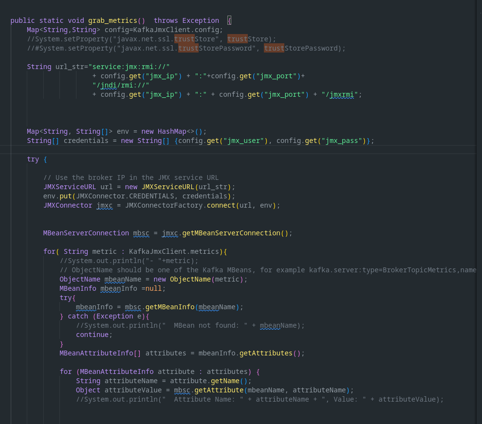

## Enter the project directory
```bash
cd kafka-jmx-exporter
```

## Create the jmx exporter config map
This configmap relies on the existing KAFKA service endpoint. So be sure to have the kafka service and pod up beforehand
```bash
kubectl create configmap kafka-jmx-monitor-config --from-literal=jmx_ip=<SERVICE DNS ENTRY FOR THE KAFKA_POD> --from-literal=jmx_port=9999 --from-literal=jmx_user='' --from-literal=jmx_pass='' --from-file=metrics.txt -n kafka-jmx-monitor
```

## Create the service and pod
```bash
kubectl apply -f kafka-jmx-monitor.yaml -n kafka-jmx-monitor
kubectl apply -f kafka-jmx-monitor-service.yaml -n kafka-jmx-monitor
```

## get the service DNS entry, and visit from your browser, we are looking for -> kafka-jmx
- you can see the entry runs on port 8080 and is k8s-kafkajmx-kafkajmx-71f15678d6-e254a50912e19d7c.elb.us-east-1.amazonaws.com:8080
- you can visit this in the browser to directly see the metrics being generated
- the custom monitor is annotated so that prometheus will automatically pickup these metrics and report on them

```bash
kubectl get svc -n kafka-jmx-monitor

NAME         TYPE           CLUSTER-IP       EXTERNAL-IP                                                                     PORT(S)                                        AGE
kafka-jmx    LoadBalancer   10.100.50.104    k8s-kafkajmx-kafkajmx-71f15678d6-e254a50912e19d7c.elb.us-east-1.amazonaws.com   8080:32475/TCP                                 4m30s
kafka-jmx1   LoadBalancer   10.100.198.103   k8s-kafkajmx-kafkajmx-36b4e7d354-257752cdafb8e7c7.elb.us-east-1.amazonaws.com   9999:31410/TCP                                 53m
kafka-jmx2   LoadBalancer   10.100.72.184    k8s-kafkajmx-kafkajmx-0eb72b716c-31897e8b9c5db0f6.elb.us-east-1.amazonaws.com   9999:31080/TCP                                 53m
kafka-jmx3   LoadBalancer   10.100.181.211   k8s-kafkajmx-kafkajmx-ab210eb8ca-7de291bd2d4fc8ac.elb.us-east-1.amazonaws.com   9999:30148/TCP                                 53m
kafka1       LoadBalancer   10.100.52.233    k8s-kafkajmx-kafka1-af652f4188-1a664c27aa4d0461.elb.us-east-1.amazonaws.com     9092:32561/TCP                                 14m
kafka2       LoadBalancer   10.100.63.241    k8s-kafkajmx-kafka2-4c9b62526e-d0000022df5dcde0.elb.us-east-1.amazonaws.com     9092:31420/TCP                                 14m
kafka3       LoadBalancer   10.100.83.181    k8s-kafkajmx-kafka3-c4287d8998-a52e4aeb9aa9190a.elb.us-east-1.amazonaws.com     9092:32225/TCP                                 14m
zoo1         LoadBalancer   10.100.123.108   k8s-kafkajmx-zoo1-a44207430c-831d5ac1e5f74229.elb.us-east-1.amazonaws.com       2181:31859/TCP,2888:30026/TCP,3888:30216/TCP   20h
zoo2         LoadBalancer   10.100.175.26    k8s-kafkajmx-zoo2-1a51e6edaf-48d45bb5992a17c9.elb.us-east-1.amazonaws.com       2181:31564/TCP,2888:32611/TCP,3888:32495/TCP   20h
zoo3         LoadBalancer   10.100.223.148   k8s-kafkajmx-zoo3-6a383ef429-e2aa947cf2094fe4.elb.us-east-1.amazonaws.com       2181:30159/TCP,2888:30905/TCP,3888:31708/TCP   20h

```


## Explore java JMX Metrics through jconsole
```
jconsole <BROKER_URL:BROKER_PORT>
```
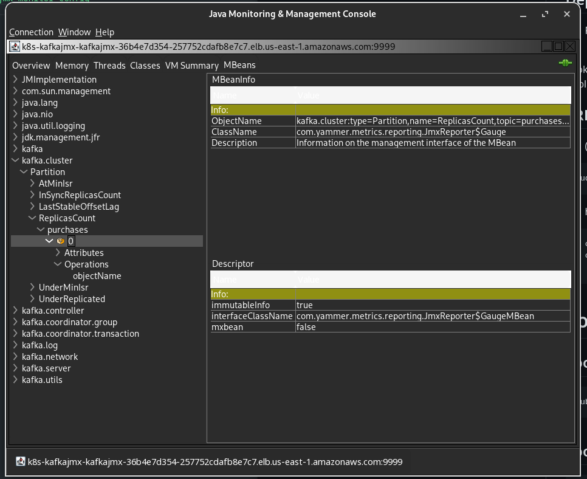


# Prometheus
## Prometheus setup
```
kubectl create namespace prometheus
```

## Add the prometheus chart to your helm repo
```
helm repo add prometheus-community https://prometheus-community.github.io/helm-charts
```

## Install prometheus
Prometheus is installed by helm using a chart. This chart can take a supplemental yaml file to bake in rules, alerting and integrations. A prebuilt values file is provided in the yaml folder.

```

helm install -f yaml/prometheus-values.yaml prometheus -n prometheus prometheus-community/prometheus  --set alertmanager.persistentVolume.storageClass="gp2",server.persistentVolume.storageClass="gp2"


NAME: prometheus
LAST DEPLOYED: Fri Jul 28 16:28:21 2023
NAMESPACE: prometheus
STATUS: deployed
REVISION: 1
TEST SUITE: None
NOTES:
The Prometheus server can be accessed via port 80 on the following DNS name from within your cluster:
prometheus-server.prometheus.svc.cluster.local


Get the Prometheus server URL by running these commands in the same shell:
  export POD_NAME=$(kubectl get pods --namespace prometheus -l "app.kubernetes.io/name=prometheus,app.kubernetes.io/instance=prometheus" -o jsonpath="{.items[0].metadata.name}")
  kubectl --namespace prometheus port-forward $POD_NAME 9090


The Prometheus alertmanager can be accessed via port 9093 on the following DNS name from within your cluster:
prometheus-alertmanager.prometheus.svc.cluster.local


Get the Alertmanager URL by running these commands in the same shell:
  export POD_NAME=$(kubectl get pods --namespace prometheus -l "app.kubernetes.io/name=alertmanager,app.kubernetes.io/instance=prometheus" -o jsonpath="{.items[0].metadata.name}")
  kubectl --namespace prometheus port-forward $POD_NAME 9093
#################################################################################
######   WARNING: Pod Security Policy has been disabled by default since    #####
######            it deprecated after k8s 1.25+. use                        #####
######            (index .Values "prometheus-node-exporter" "rbac"          #####
###### .          "pspEnabled") with (index .Values                         #####
######            "prometheus-node-exporter" "rbac" "pspAnnotations")       #####
######            in case you still need it.                                #####
#################################################################################


The Prometheus PushGateway can be accessed via port 9091 on the following DNS name from within your cluster:
prometheus-prometheus-pushgateway.prometheus.svc.cluster.local


Get the PushGateway URL by running these commands in the same shell:
  export POD_NAME=$(kubectl get pods --namespace prometheus -l "app=prometheus-pushgateway,component=pushgateway" -o jsonpath="{.items[0].metadata.name}")
  kubectl --namespace prometheus port-forward $POD_NAME 9091

For more information on running Prometheus, visit:
https://prometheus.io/
```


## Validate prometheus
```
kubectl get pods -n prometheus
NAME                                               READY   STATUS    RESTARTS   AGE
prometheus-alertmanager-0                          1/1     Running   0          50s
prometheus-kube-state-metrics-7dbc868f65-j7wpg     1/1     Running   0          50s
prometheus-prometheus-node-exporter-2kv47          1/1     Running   0          50s
prometheus-prometheus-node-exporter-df2g9          1/1     Running   0          50s
prometheus-prometheus-node-exporter-gd9j2          1/1     Running   0          50s
prometheus-prometheus-node-exporter-qbkc4          1/1     Running   0          50s
prometheus-prometheus-node-exporter-svrdr          1/1     Running   0          50s
prometheus-prometheus-node-exporter-th9bt          1/1     Running   0          50s
prometheus-prometheus-pushgateway-dfbf8b54-96kg8   1/1     Running   0          50s
prometheus-server-758d4c978c-cddlk                 2/2     Running   0          50s
```

## Open the prometheus UI
- setup a port-forwarding session for prometheus using the make command
- open your  browser to localhost:9090
```
make pf-prometheus 

PROMETHEUS_NS=prometheus;\
PROMETHEUS_SERVER=prometheus-server-758d4c978c-cddlk; \
kubectl port-forward  $PROMETHEUS_SERVER -n $PROMETHEUS_NS 9090

```
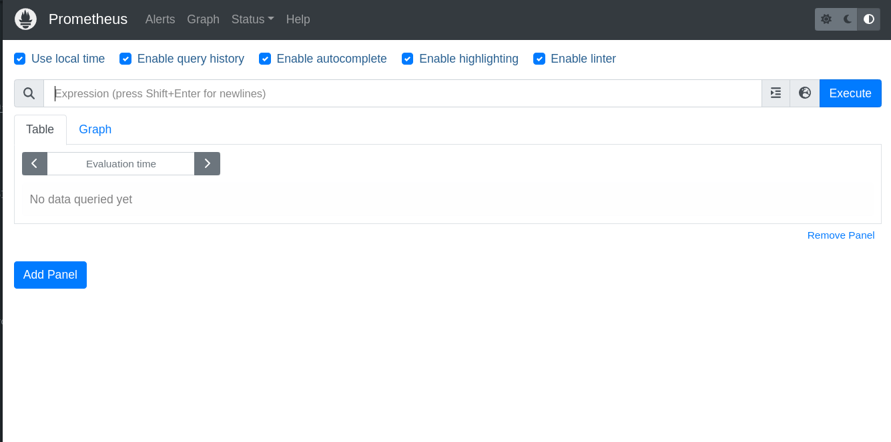


## Check out the listed targets for prometheus
Navigate to localhost:9090 and click on the status menu and select targets
- notice more that the kafka targets are available. prometheus scans for annotations of what to monitor
- the KAFKA JMX Exporter targets are the ones on port 19000
- the custom JMX exporter is on port 8080
- you can also tell which targets are kafka and which are custom by looking at the labels

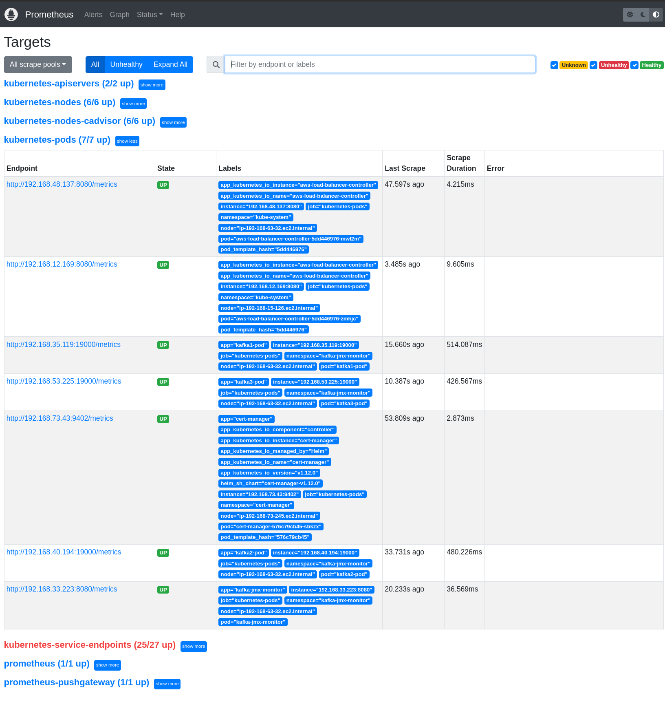


## Explore metrics
Navigate to localhost:9090 and click on the graphs tab. 
- using the UI you can quickly explore metrics and visualize them
- these are temporary graphs. for permanent graphs, they must be configured in the values.yaml file.
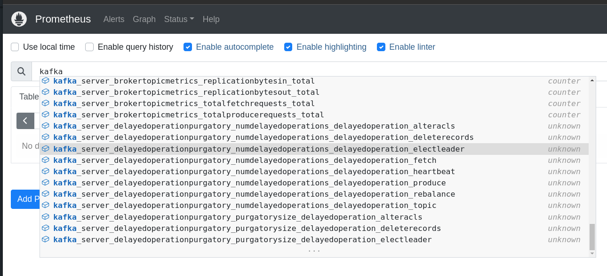
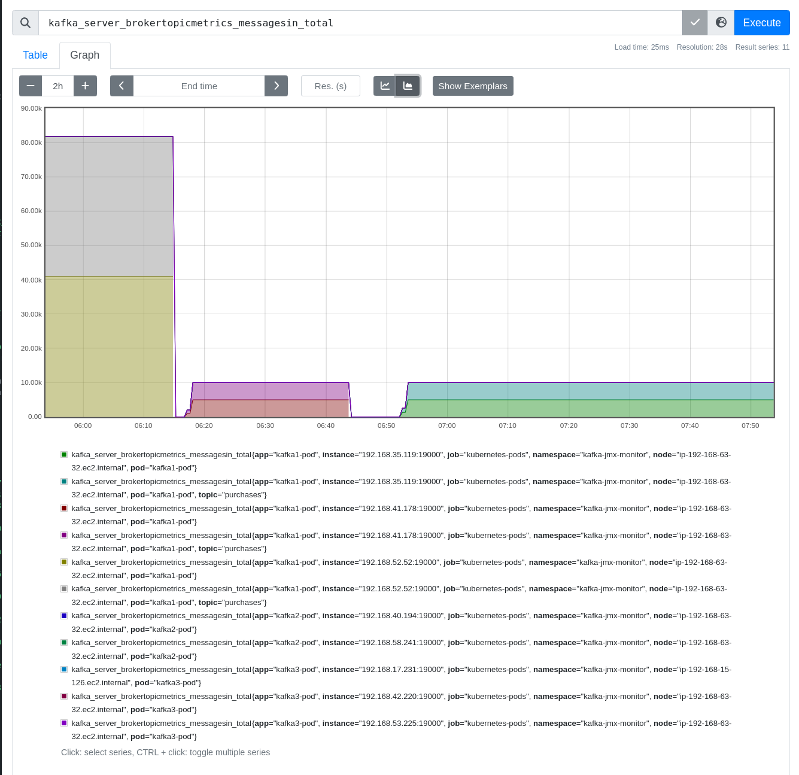
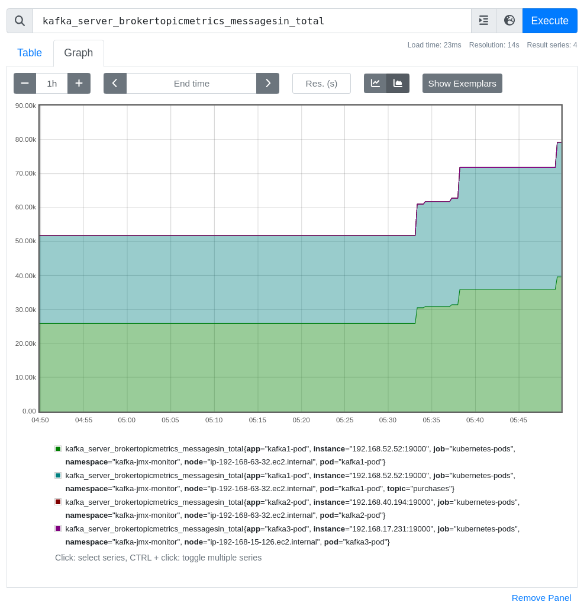
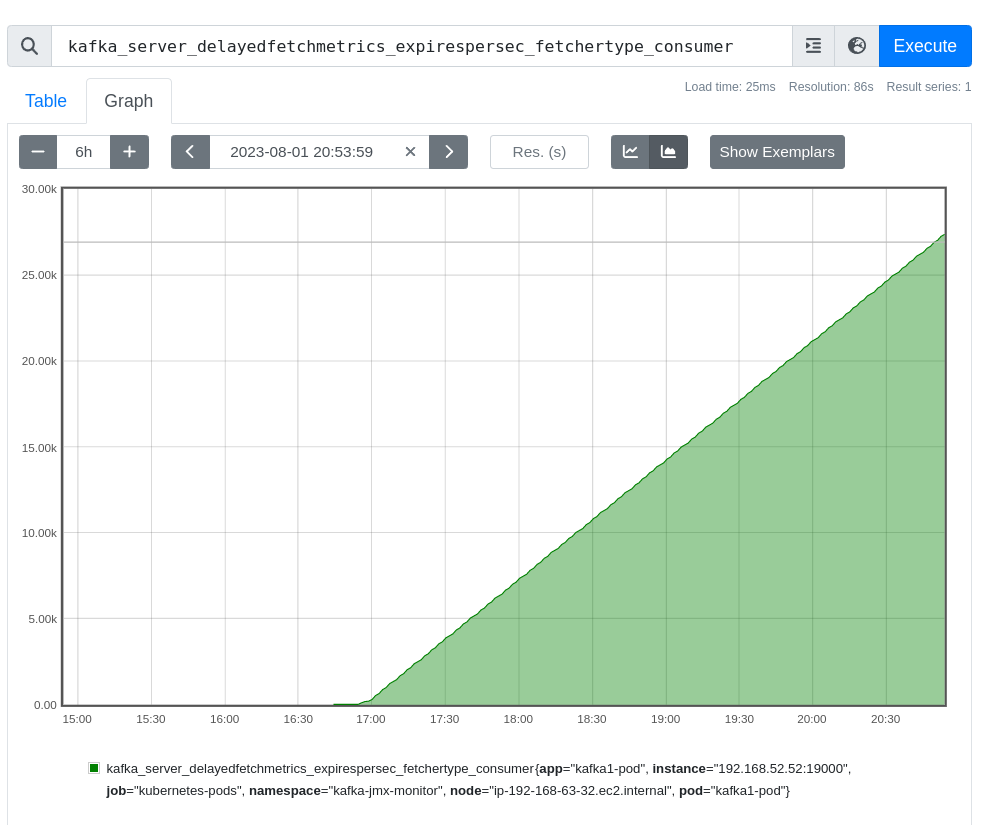
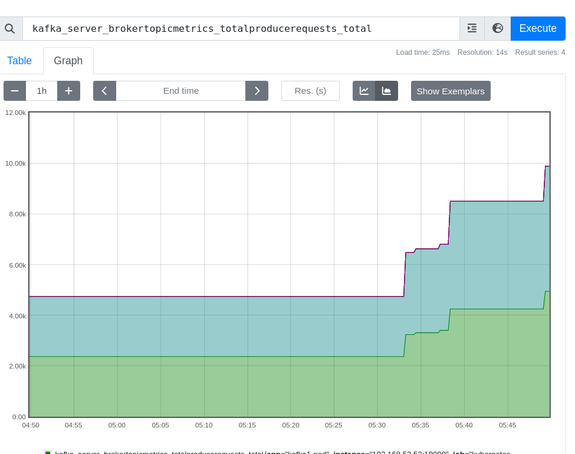


## Checkout the Rules
In the prometheus UI navigate to the menu item  status -> rules
- These rules are created in your values override file when prometheus is installed by helm
- The rules are stored in a configmap in the prometheus namespace

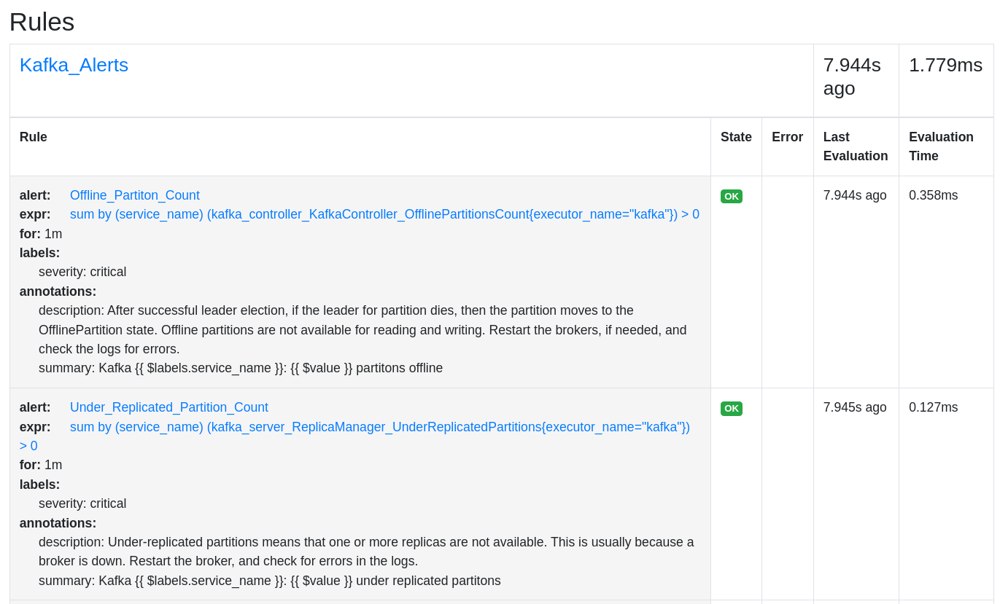


## Checkout the Alerts
In the prometheus UI navigate to the menu item  alerts
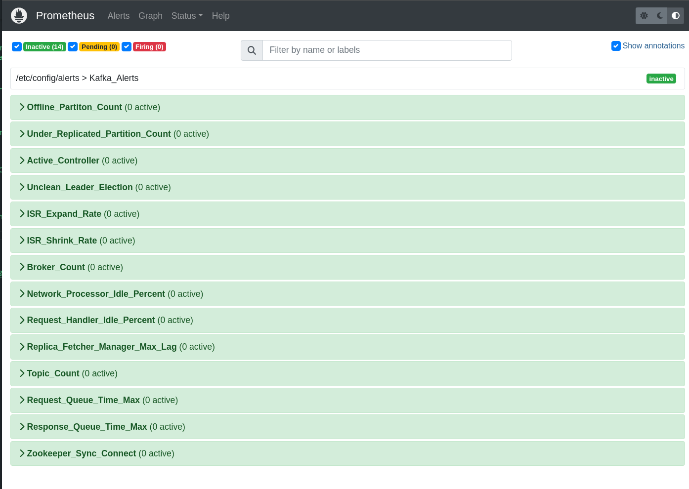

# Example Alert
- This lists all metrics you wish to alert on.
- Green is good
- Yellow is pending, meaning it MIGHT be an alert but it hasn't fallen outside of thresholds yet
- Red is an alert and it has fallen outside of thresholds, this will send an alert via alertmonitor and the set alert route. Which may be slack, email or a script.

- Example of a Pending alert
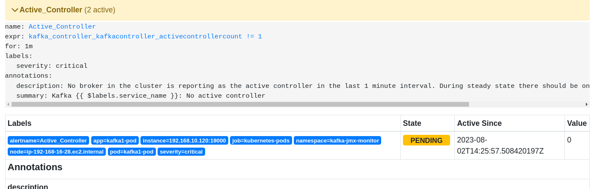
- Example of a Firing alert
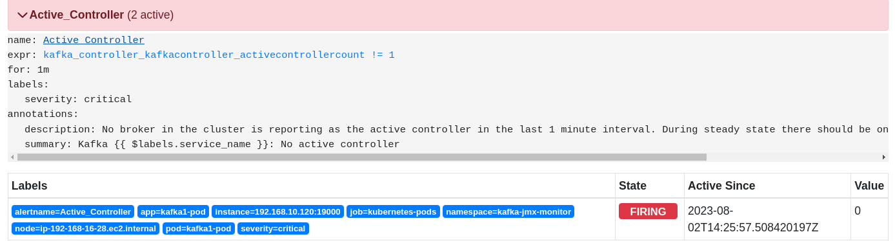

When an alert fires it follows its configuration in the alertmanager.yml which is populated through the values file. 
- From here you can control the frequency of alerts per group
- Alert intervals
- Alert timeouts
- Alert routing through integrations, such as slack or email

